# Wireframe Library

> A wireframing library for Sketch. Follows the [Atomic Design](https://atomicdesign.bradfrost.com/chapter-2/ "Atomic Design by Brad Frost") methodology.

## Global Styles
### Colors

## Atoms
### Buttons
#### Primary Buttons
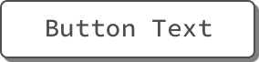
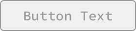

#### Secondary Buttons

#### Tertiary Buttons

#### Split Buttons
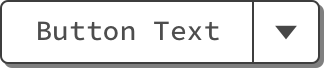
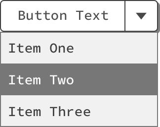

### Controls
#### Drop-Downs
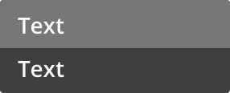
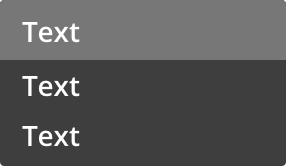
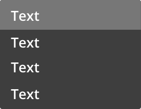

#### Toggles

#### Search Box

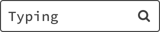

>Pro-Tip: Use with `Utilities/Cursors/Typing Cursor`.

#### Filter Chips
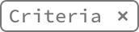

#### Segmented Navigation

### Forms

#### Text Inputs

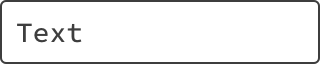
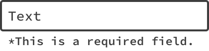

#### Drop-Downs
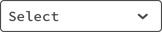

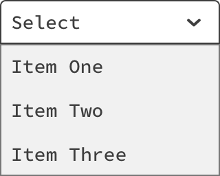
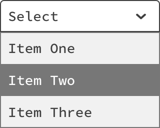

#### Steppers

Numeric

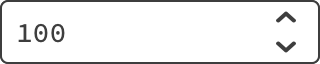

Date

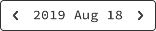

Time

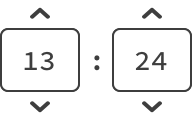

#### Checkboxes

With Labels:

#### Radios

#### Buttons
!>See <a href="#/?id=buttons">Atoms/Buttons</a>

### Informational

#### Progress Indicators
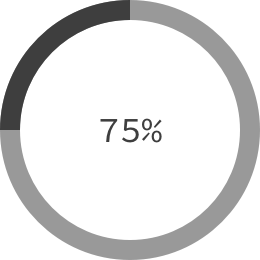

Small:

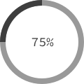

Bar:

#### Unread Counters
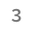

#### Highlight

>Use this block in _front_ of text, its blend mode is set to Multiply.\
> 

### Navigation
!>These atoms are included in this guide in the interest of being thourough. Skip to their corresponding Molecules for usage guidelines.
#### Step Trackers
 
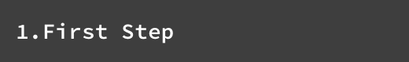 
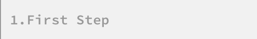

#### Tabs

## Molecules
### Modals
#### Alert
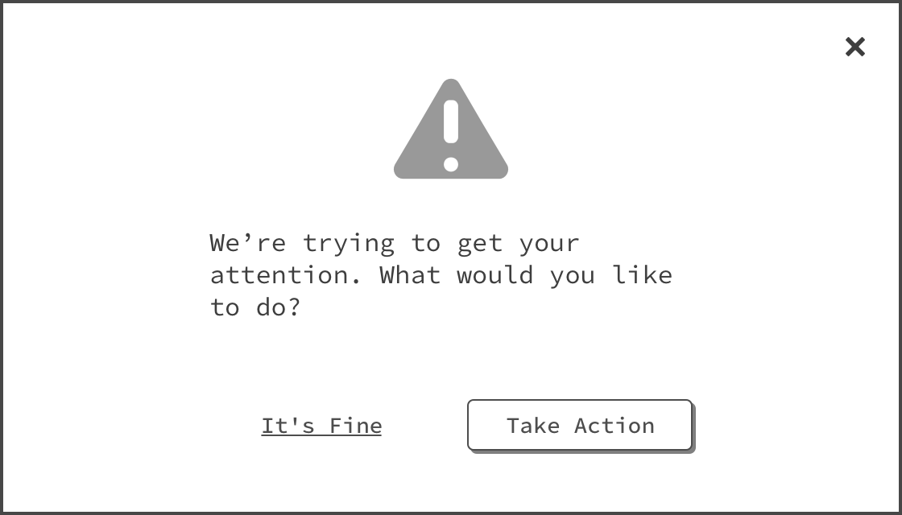

#### Informational
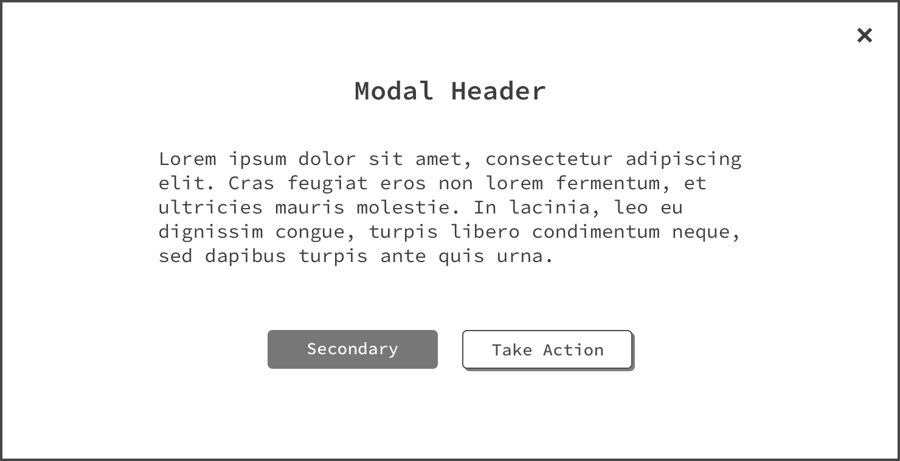

#### Success
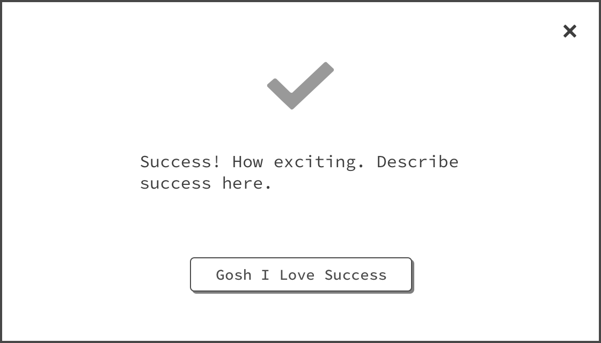

### Navigation
#### Step Trackers

Two-Step

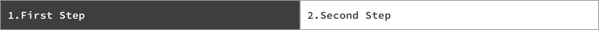

Three-Step

Four-Step

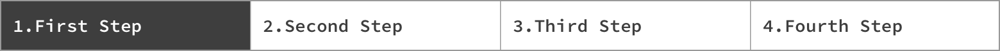

Five-Step

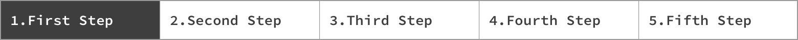

#### Tabs

### Notifications
#### Toast Messages
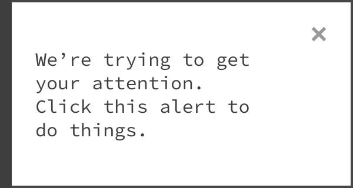
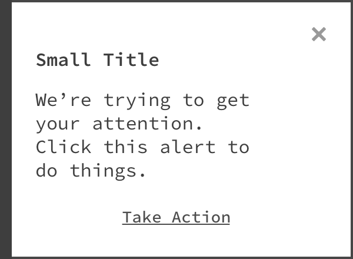

#### Tooltips
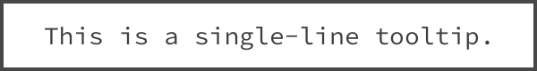
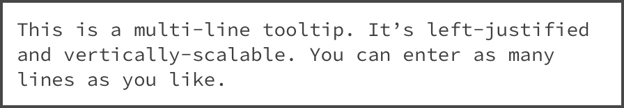

#### File Upload
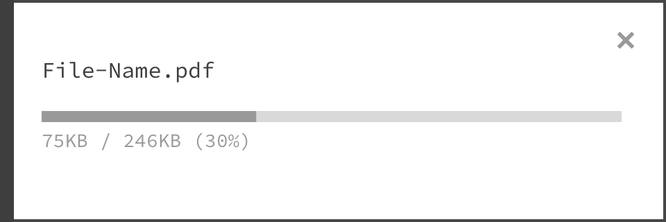

## Organisms
### Data Visualization
#### Line Graph
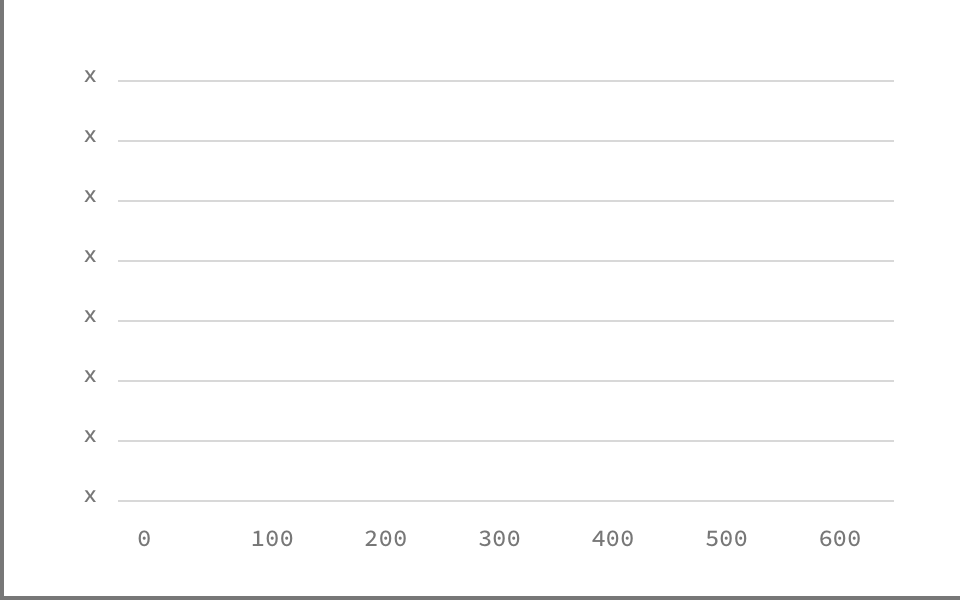

#### Pie Chart
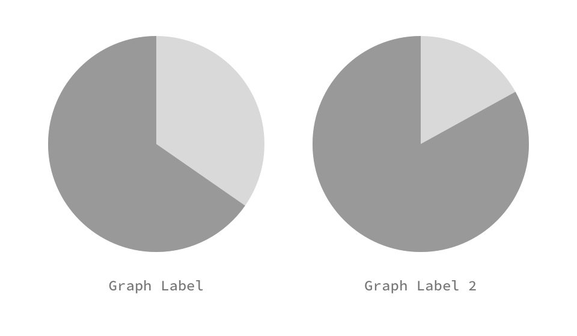

#### Bar Chart

## Utilities
### Content
#### User Icons

#### Image Placeholder
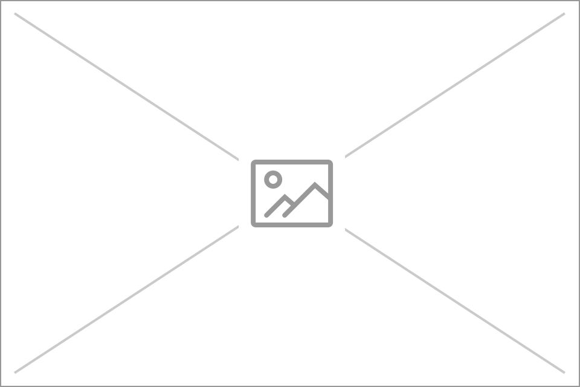

#### Maps
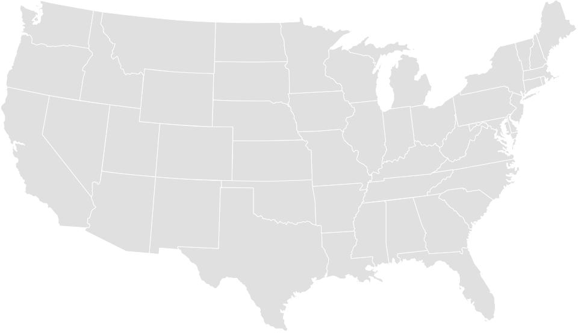
 

### Cursors

### Notes
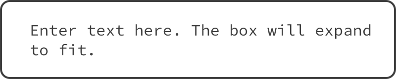
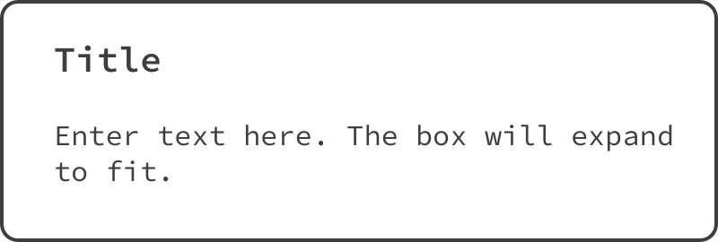

>Useful for annotating wireframes.
