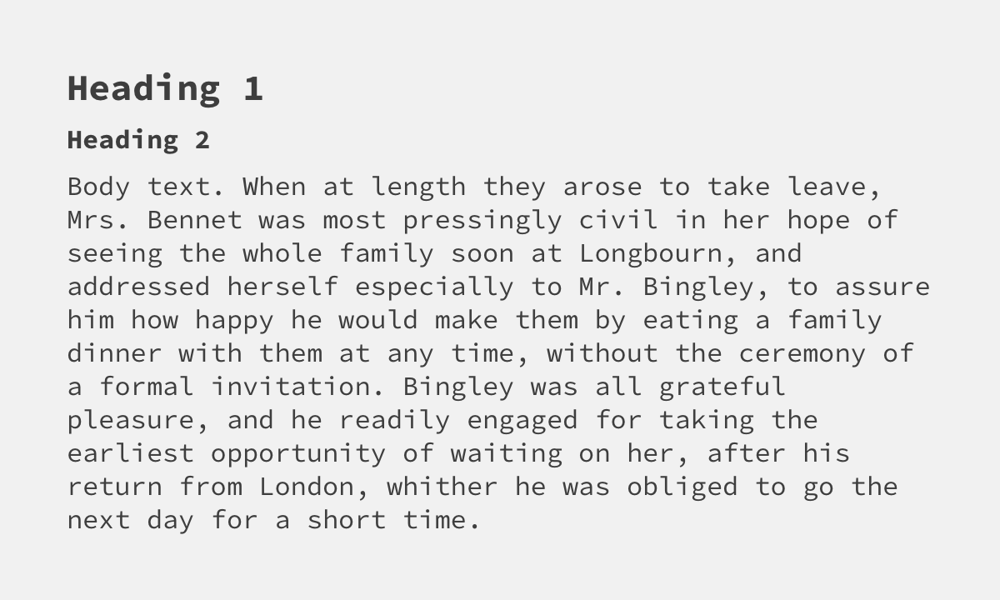
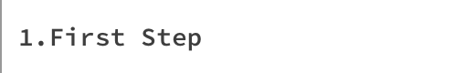
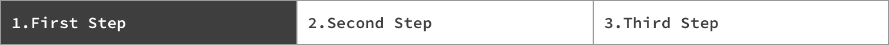
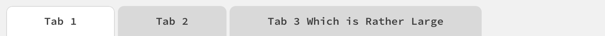
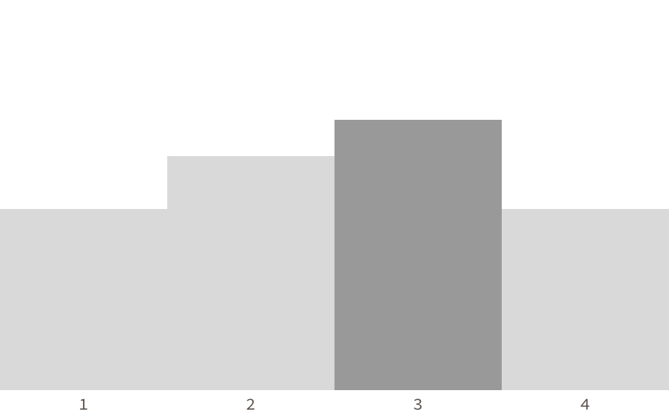

# Nucleus: A Wireframe Library + Low Fidelity Design System

A wireframing library for Sketch meant to bridge the gap between sketching and high fidelity, this library provides building-blocks to rapidly create wireframes and prototypes. It's been kept intentionally simple in execution&mdash;if it's not in this library, you should be able to create it with lines and boxes. Good wireframes aren't about the details, so the details have been left out.

Created by <a href="https://twitter.com/mjchamplin">Michael Champlin</a>.

Follows the [Atomic Design](https://atomicdesign.bradfrost.com/chapter-2/ "Atomic Design by Brad Frost") methodology.

  <button class="download" onclick="location.href='https://github.com/mjchamplin/Nucleus/blob/master/sketch/Nucleus%20Wireframing%20Library.sketch?raw=true'" type="button">Download</button>
  
v1.0 - Sketch file, 765KB

!> This library requires _Source Code Pro_, a free typeface available through [GitHub](https://github.com/adobe-fonts/source-code-pro), [Google Fonts](https://fonts.google.com/specimen/Source+Code+Pro) and [Adobe Fonts](https://fonts.adobe.com/fonts/source-code-pro).

## Global Styles
### Colors

### Text Styles

## Atoms
### Icons

Control

General

### Buttons
#### Primary Buttons

#### Secondary Buttons

#### Tertiary Buttons

#### Split Buttons

### Controls
#### Drop-Downs

#### Toggles

#### Search Box

>Pro-Tip: Use with `Utilities/Cursors/Typing Cursor`.

#### Filter Chips

#### Segmented Navigation

### Forms

#### Text Inputs

#### Drop-Downs

#### Steppers

Numeric

Date

Time

#### Checkboxes

With Labels:

#### Radios

#### Buttons
!>See <a href="#/?id=buttons">Atoms/Buttons</a>

### Informational

#### Progress Indicators

Small:

Bar:

#### Unread Counters

#### Highlight

>Use this block in _front_ of text, its blend mode is set to Multiply.\
> 

### Navigation
!>These atoms are included here in the interest of thoroughness. See their corresponding Molecules for usage guidelines.
#### Step Trackers
 
 

#### Tabs

## Molecules
### Modals
#### Alert

#### Informational

#### Success

### Navigation
#### Step Trackers

Two-Step

Three-Step

Four-Step

Five-Step

#### Tabs

### Notifications
#### Toast Messages

#### Tooltips

#### File Upload

## Organisms
### Data Visualization
#### Line Graph

#### Pie Chart

#### Bar Chart

## Utilities
### Content
#### User Icons

#### Image Placeholder

#### Maps

 

### Cursors

### Notes

>Useful for annotating wireframes.

<small>Licensed under [Creative Commons Attribution Share Alike 4.0 International](https://github.com/mjchamplin/Nucleus/blob/master/LICENSE.md) license.</small>
